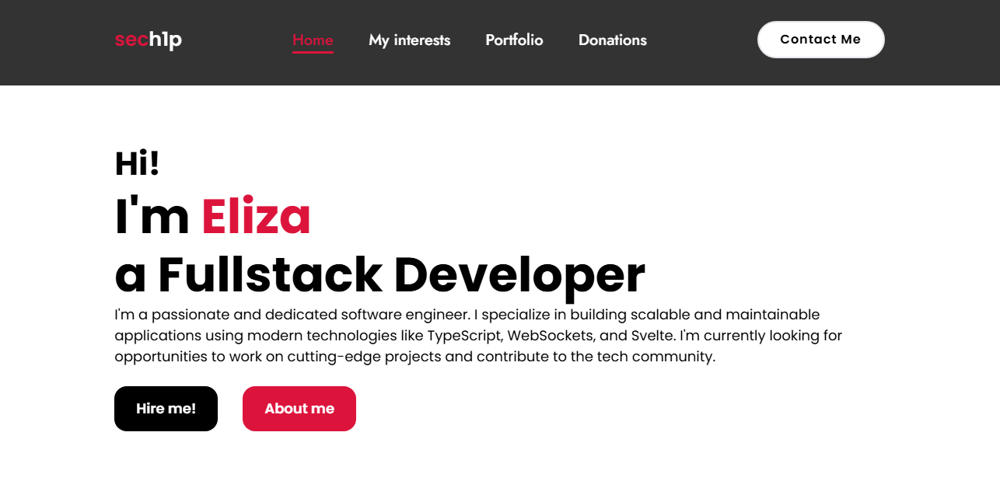

# 🌐 sech1p.ovh



Source code of my personal website and portfolio.

## 💻 About

This is the source code of my personal website, which I built using the Svelte and TailwindCSS frameworks.

## 🔧 Building

Replace all EmailJS placeholders in the `src/pages/Contact.svelte` file with real values, then open the terminal and run the following commands:

```sh
$ npm i
$ npm run build
```

The website has been built and is located in the `dist` folder.

## 📝 License

My portfolio is licensed under `Apache-2.0` [license](LICENSE).
